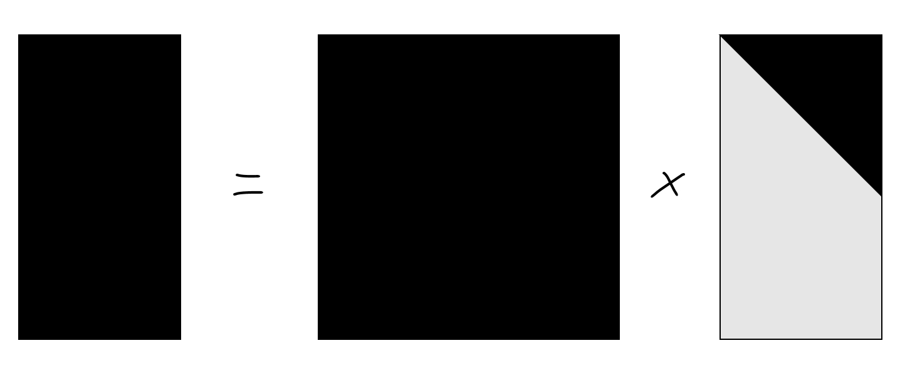
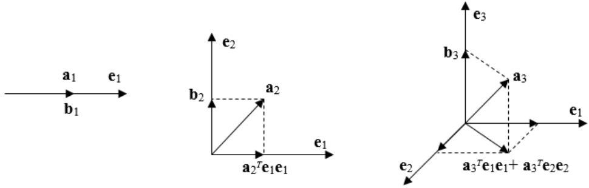
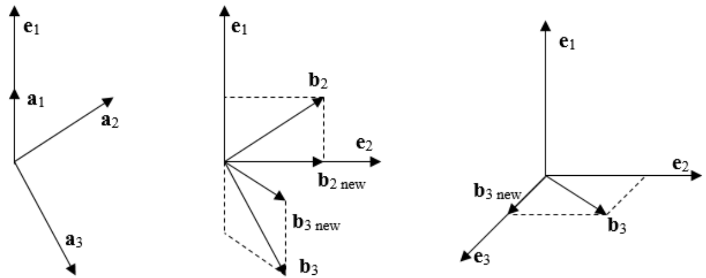

前一阵总结了一下常用的QR分解的方法，这里做一记录。

## Gram-Schmidt正交化

### 基本思想

__Gram-Schmidt正交化__

给定线性无关组$\alpha_1,\alpha_2,\cdots,\alpha_n$，构造单位正交基$q_1,q_2,\cdots,q_n$，使得$\text{span}(\alpha_1,\alpha_2,\cdots,\alpha_n)=\text{span}(q_1,q_2,\cdots,q_n)$。

采用的基本方法是投影法，即从$\alpha_1,\alpha_2,\cdots,\alpha_n$中依次减去其在$\text{span}(q_1,q_2,\cdots,q_{i-1})$上的投影，得到$q_i$。

$\alpha$在$\beta$上的投影是：$\frac{\alpha^T\beta}{\beta^T\beta}\beta$。

### CGS算法

给定线性无关组$\alpha_1,\alpha_2,\cdots,\alpha_n$。

$$\begin{aligned}
    \widetilde{q_1} & = \alpha_1                                                                                                                                                                                                                                                                              \\
    \widetilde{q_2} & = \alpha_2-\frac{\alpha_2^T\widetilde{q_1}}{\widetilde{q_1}^T\widetilde{q_1}}\widetilde{q_1}                                                                                                                                                                                            \\
    \widetilde{q_3} & = \alpha_3-\frac{\alpha_3^T\widetilde{q_1}}{\widetilde{q_1}^T\widetilde{q_1}}\widetilde{q_1}-\frac{\alpha_3^T\widetilde{q_2}}{\widetilde{q_2}^T\widetilde{q_2}}\widetilde{q_2}                                                                                                          \\
                    & \cdots                                                                                                                                                                                                                                                                                  \\
    \widetilde{q_n} & = \alpha_n-\frac{\alpha_n^T\widetilde{q_1}}{\widetilde{q_1}^T\widetilde{q_1}}\widetilde{q_1}-\frac{\alpha_n^T\widetilde{q_2}}{\widetilde{q_2}^T\widetilde{q_2}}\widetilde{q_2}-\cdots-\frac{\alpha_n^T\widetilde{q_{n-1}}}{\widetilde{q_{n-1}}^T\widetilde{q_{n-1}}}\widetilde{q_{n-1}}
\end{aligned}$$

得到的$\widetilde{q_1},\widetilde{q_2},\cdots,\widetilde{q_n}$是一组正交基。之后把每个向量单位化：$q_i=\frac{\widetilde{q_i}}{\|\widetilde{q_i}\|}$即可。

__Classic Gram--Schmidt Orthogonalization算法 CGS__

我们可以把上面的式子写成矩阵形式，对于可逆矩阵$A=\begin{bmatrix}
      \alpha_1 & \alpha_2 & \cdots & \alpha_n
    \end{bmatrix}$：

$$\begin{aligned}
    A
     & =
    \begin{bmatrix}
      \widetilde{q_1} &
      \widetilde{q_2} &
      \cdots          &
      \widetilde{q_n}
    \end{bmatrix}
    \begin{bmatrix}
      1      & -\frac{\alpha_2^T\widetilde{q_1}}{\widetilde{q}_1^T\widetilde{q_1}} & \cdots & -\frac{\alpha_n^T\widetilde{q_1}}{\widetilde{q}_1^T\widetilde{q_1}} \\
      0      & 1                                                                   & \cdots & -\frac{\alpha_n^T\widetilde{q_2}}{\widetilde{q}_2^T\widetilde{q_2}} \\
      \vdots & \vdots                                                              & \ddots & \vdots                                                              \\
      0      & 0                                                                   & \cdots & 1
    \end{bmatrix}
    \\
     & = \widetilde{Q} \widetilde{R}                                                                    \\
     & = Q \cdot diag(\|\widetilde{q_1}\|,\|\widetilde{q_2}\|,\cdots,\|\widetilde{q_n}\|) \widetilde{R} \\
     & = QR
\end{aligned}$$

仍能保证$R$是一个上三角阵，且对角元为$\|\widetilde{q_1}\|,\|\widetilde{q_2}\|,\cdots,\|\widetilde{q_n}\|$。

> 注：
> 
> -   $Q$是一个正交矩阵，即$Q^TQ=I$
>
> -   $R$是一个对角元为正的上三角阵
>
> -   $A$是满秩的方阵
>
> -   这样的分解是唯一的

事实上QR分解对非方阵$(m\times n,m \geq n)$也成立。

<figure>

</figure>

### $m\times n$矩阵的QR分解

对于$m\times n$的矩阵$A$：

-   (简化QR分解)存在一个$m\times n$的列正交矩阵$Q_1$，和有非负对角元的$n\times n$的上三角矩阵$R_1$，使得$A=Q_1R_1$

-   (QR分解)存在一个$m\times m$的正交矩阵$Q$，和$m\times n$的矩阵$R$，使得$A=QR$。其中
    $Q = \begin{bmatrix}
          Q_1 & Q_2 
        \end{bmatrix}$
        ，
        $R = \begin{bmatrix} R_1  &0 \end{bmatrix}^T$
        。其中$Q$由$Q_1$的列向量扩充得到。

对于列满秩的矩阵$A$，第一条本身就是 Gram--Schmidt
正交化的结果，$Q_1$的列向量就是被正交归一化的$A$的列向量。

在此基础上，只用扩充$Q$的列向量，就可以得到第二条。

**对$A$更新（补充）列的方法来证明第一条成立：**

（奠基略去）如果结论对$m\times (n-1)$，考虑$A=\begin{bmatrix}
      A_0 & \alpha_n
    \end{bmatrix}$，其中$A_0=Q_1R_1$。

1.如果$a_n \in \mathcal{R}(Q_0)$，就可以找到一个$\mathbf{r}_n$，使得$\alpha_n=Q_0\mathbf{r}_n$，任取一个新的与$Q_0$列向量都正交的向量$\mathbf{q}_n$：

$$\begin{aligned}
    A & =
    \begin{bmatrix}
      A_0 & \alpha_n
    \end{bmatrix}
    \\
      & =
    \begin{bmatrix}
      Q_0 R_0 & Q_0 \mathbf{r}_n
    \end{bmatrix}
    \\
      & =
    \begin{bmatrix}
      Q_0 & q_n
    \end{bmatrix}
    \begin{bmatrix}
      R_0          & \mathbf{r}_n \\
      \mathbf{0}^T & 0
    \end{bmatrix}
    \\
      & = Q_1 R_1
\end{aligned}$$

**对$A$更新（补充）列的方法来证明第一条成立：**

2.如果$a_n \notin \mathcal{R}(Q_0)$，我们直接做Gram-Schmidt正交化即可。

同之前地，$\widetilde{q}_n=\alpha_n - Q_0 \mathbf{r}_n$，$q_n=\frac{\widetilde{q}_n}{\|\widetilde{q}_n\|}$。

$$\begin{aligned}
    A & =
    \begin{bmatrix}
      A_0 & \alpha_n
    \end{bmatrix}
    \\
      & =
    \begin{bmatrix}
      Q_0 R_0 & Q_0 \mathbf{r}_n + \|\widetilde{q}_n\| q_n
    \end{bmatrix}
    \\
      & =
    \begin{bmatrix}
      Q_0 & q_n
    \end{bmatrix}
    \begin{bmatrix}
      R_0          & \mathbf{r}_n        \\
      \mathbf{0}^T & \|\widetilde{q}_n\|
    \end{bmatrix}
    \\
      & = Q_1 R_1
\end{aligned}$$

这样就可以证明对于$m\times n$矩阵（不要求列满秩，若只使用GS正交化就只能为列满秩的矩阵）的QR分解。

### 复杂度及稳定性

复杂度、稳定性 下面计算这种方法的复杂度：

-   计算$\widetilde{q_i}$做$i-1$次内积，和$1$次做差的正交化（顺便算出$\mathbf{r}_i$）：$(i-1)(2m-1)+2(i-1)m$ flops

-   计算$\widetilde{q_i}$的模长$\|\widetilde{q_i}\|$以及$q_i$：$3m$ flops

总的复杂度（约）为$2mn^2$ flops。

由于浮点数存储的舍入误差，在一定范围（误差积累）后，随着$n$增大，$Q$矩阵逐渐失去正交性，稳定性较低。

### MGS算法

__Modified Gram--Schmidt Orthogonalization 算法 MGS__

相当于对CGS改变了次序：

-   首先选定一个向量作为第一个基准，然后将其余所有向量都投影到该基准的正交空间中。在该正交空间中，对剩下的向量重复前面的工作，那么最后所有的向量都是相互正交的了。

-   每次迭代步骤除了计算出一个正交向量积外，还通过计算使得其他未计算好的基向量都与算好的基向量正交。

CGS每次计算$R$的一个列，MGS每次计算$R$的一行。

CGS不断增添$Q$的列，MGS不断把$A$调整为$Q$。

<figure>

 

<figcaption>
CGS和MGS的对比
</figcaption>
</figure>

__复杂度__ CGM与MGS的过程是等价的，它们的复杂度相同，为$2mn^2$ flops。

__稳定性__
MGS的稳定性要比CGS高，它计算量越往后是逐步减少的，因此前面计算积累的误差的影响就不会剧烈地扩散开，所以MGS可以使求得的矩阵Q的正交性更好。

## Householder与Givens变换

### 正交变换

__正交矩阵__

-   正交矩阵$Q$是一个方阵，满足$Q^TQ=I$。

__正交变换__

-   正交变换是一个线性变换，它保持向量的长度和向量之间的夹角。
  
    $$\begin{aligned}
                  \mathbf{y}=Q\mathbf{x},\|\mathbf{y}\|=\|\mathbf{x}\|,\mathbf{y}^T\mathbf{x}=\mathbf{x}^T\mathbf{y}  
    \end{aligned}$$

-   正交变换可以用正交矩阵表示。

二维的正交变换只有两种：旋转和反射。由此给出Householder变换和Givens变换。

### Householder变换

__Householder矩阵__
$H_{\mathbf{u}}$是$\mathbb{R}^n$上的反射变换，反射面为$\mathbf{u}$的正交补空间：

$$\begin{aligned}
      H_{\mathbf{u}} & = I - 2\mathbf{u}\mathbf{u}^T
\end{aligned}$$

其中$\mathbf{u}$是一个单位向量，$H$是一个正交、对称矩阵。

注意到对任意的$\mathbf{v}$，有： 

$$\begin{aligned}
    \mathbf{v}               & = (I-\mathbf{u}\mathbf{u}^T)\mathbf{v} + \mathbf{u}\mathbf{u}^T\mathbf{v} \\
    H_{\mathbf{u}}\mathbf{v} & = (I-\mathbf{u}\mathbf{u}^T)\mathbf{v} - \mathbf{u}\mathbf{u}^T\mathbf{v}
\end{aligned}$$

其中$(I-\mathbf{u}\mathbf{u}^T)\mathbf{v}$是$\mathbf{v}$在$\mathbf{u}$的正交补空间上的投影，$\mathbf{u}\mathbf{u}^T\mathbf{v}$是$\mathbf{v}$在$\mathbf{u}$上的投影。即$H_{\mathbf{u}}$把$\mathbf{v}$映射到$\mathbf{v}$在$\mathbf{u}$的正交补空间上的投影的负向量。

__Householder变换__

-   Householder变换可以用Householder矩阵表示。

-   $\det{H}=-1$：因为正交相似于$H_{\boldsymbol{e_1}}=daig(-1,1,1,\dots,1)$。

-   Householder变换可以使任何非零向量$\boldsymbol{\xi}$变成与给定单位向量$\boldsymbol{\zeta}$同方向的向量$\boldsymbol{\eta}$。

###  Givens变换

__Givens矩阵__
$G_{\theta;i,j}$是$\mathbb{R}^n$上的旋转变换，旋转面为$\mathbf{e}_i$和$\mathbf{e}_j$张成的平面：

$$\begin{aligned}
      G_{\theta;i,j} =\begin{bmatrix}
                        \ddots      &   & \phantom{\cos \theta} & \phantom{1} & \phantom{1} & \phantom{1} & \phantom{-\sin \theta} & \phantom{1} & \phantom{1} \\
                                    & 1 & \phantom{1}           & \phantom{1} & \phantom{1} & \phantom{1} & \phantom{-\sin \theta} & \phantom{1} & \phantom{1} \\
                        \phantom{1} &   & \cos \theta           & \phantom{1} & \cdots      & \phantom{1} & -\sin \theta           & \phantom{1} & \phantom{1} \\
                        \phantom{1} &   & \phantom{\cos \theta} & 1           & \phantom{1} & \phantom{1} & \phantom{-\sin \theta} & \phantom{1} & \phantom{1} \\
                        \phantom{1} &   & \vdots                & \phantom{1} & \ddots      & \phantom{1} & \vdots                 & \phantom{1} & \phantom{1} \\
                        \phantom{1} &   & \phantom{\cos \theta} & \phantom{1} & \phantom{1} & 1           & \phantom{-\sin \theta} & \phantom{1} & \phantom{1} \\
                        \phantom{1} &   & \sin \theta           & \phantom{1} & \cdots      & \phantom{1} & \cos \theta            & \phantom{1} & \phantom{1} \\
                        \phantom{1} &   & \phantom{\cos \theta} & \phantom{1} & \phantom{1} & \phantom{1} & \phantom{-\sin \theta} & 1           & \phantom{1} \\
                        \phantom{1} &   & \phantom{\cos \theta} & \phantom{1} & \phantom{1} & \phantom{1} & \phantom{-\sin \theta} & \phantom{1} & \ddots      \\
                      \end{bmatrix}
\end{aligned}$$

__Givens变换__

-   Givens变换可以用Givens矩阵表示。

-   $\det{G}=1$。

-   用上面矩阵的$G_{\theta;i,j}$给出的Givens变换只改变任何非零向量$\boldsymbol{\xi}$的两个分量。

-   Givens矩阵(变换)是两个Householder矩阵(变换)的乘积(Householder矩阵比Givens矩阵更基本)。

### QR分解------Householder变换

利用Householer变换，我们也可以像上面一样通过地推(归纳)的方法来进行QR分解。对于$m\times n$的矩阵$A$：

**1.$\alpha_1 \neq \mathbf{0}$：**

我们可以构造一个Householder矩阵$Q_1$，使得$Q_1\alpha_n=\|\alpha_n\|\mathbf{e}_1$。从而$Q_1A$可以写成：

$$\begin{aligned}
    Q_1A & =
    \begin{bmatrix}
      \|\alpha_n\| & \mathbf{b}^T \\
      \mathbf{0}   & A_1
    \end{bmatrix} = \widetilde{A}_1
\end{aligned}$$

而$A_1=Q_2\begin{bmatrix}
      R_2 \\ O
    \end{bmatrix}$，从而： 
    
  $$\begin{aligned}
    \begin{bmatrix}
      1 &       \\
        & Q_2^T
    \end{bmatrix}
    Q_1A & =
    \begin{bmatrix}
      \|\alpha_1\| & \mathbf{b}^T \\
      \mathbf{0}   & R_2          \\
      \mathbf{0}   & O
    \end{bmatrix}
\end{aligned}$$

$$\begin{aligned}
    Q^TA & =R  \\
    A    & =QR
\end{aligned}$$

**2.$\alpha_1 = \alpha_2 = ... = \alpha_j-i = \mathbf{0}$但$\alpha_j \neq \mathbf{0}$：**

有$\begin{bmatrix}
      \alpha_j & \alpha_{j+1} & \cdots & \alpha_n
    \end{bmatrix}=QR_j$

从而$A=Q\begin{bmatrix}
      O & QR_j
    \end{bmatrix} = Q\begin{bmatrix}
      O & R_j
    \end{bmatrix} =QR$。

> 注
> 
> -   这个证明也说明$n$阶正交阵可以表示成不多于$n$个Householder矩阵的乘积。
> 
> -   在实际计算中，我们是对上式中的$A_1$继续进行Householder变换，使其第一列只有第一个分量。最后结果形如：
    
$$\begin{aligned}
                  Q_{n-1}...Q_2Q_1A=\widetilde{A}_n   
    \end{aligned}$$

### Householder变换的复杂度与稳定性

__复杂度__ Householder变换QR分解的复杂度约$2mn^2-2n^3/3$ flops。

__稳定性__

-   Householder算法有更好的数值计算性能，能减少计算机浮点数存储的误差，大大提高稳定性。

-   无法并行，一次性需要的内存较多。

### QR分解------Givens变换

仿照用Householder变换进行QR分解的方法，利用Givens变换也可以对$m\times n$矩阵$A$QR分解。

-   用$m-1$次Givens变换可以把$A$的第1列的最后$m-1$个元素变成0：每次用该列主对角线元素与其下面的元素构成Givens变换。

-   用$m-2$次Givens变换可以把$A$的第2列的最后$m-2$个元素变成零。

-   ...

-   设已经把$X$的前$j-1$列变成了上三角形（前$j-1$列主对角线下方的元素都变成了零。在第$j$步，用$m-j$次Givens变换把主对角线下方的元素都变成零。

> 注
> 
> -   每次变换仅影响到第$j$行和第$k$行（$k>j$），所以不会影响到所有列的前$j-1$行元素。
> 
> -   第$j$步关于第$j$和第$k$元素作Givens变换时，仅需对当前$A$的第$j, k$两行和第$j, j+1, \dots, m$列组成的两行的子矩阵作二维的Givens变换即可,
    并且对第$j$列的两个元素的变换结果分别为$\sqrt{x_j^2 + x_k^2}$和$0$，不用重复计算。

如此进行$m$步后就把$A$变成了上三角形，共需要进行$mn - \frac12 n(n+1)$次Givens变换。

## 总结与比较

| 方法        | 复杂度            | 原理              | 稳定性              |
|------------|-----------------|------------------|-------------------|
| CGS        | $2mn^2$         | 基于正交化定义       | 低                 |
| MGS        | $2mn^2$         | 修正正交化过程       | 中                 |
| Householder| $2mn^2-2n^3/3$  | 基于正交变换         | 高                 |
| Givens     | $2mn^2(?)$      | 基于正交变换         | 略低于Householder |

| 方法           | 优点                          | 缺陷                                 |
| -------------- | ----------------------------- | ------------------------------------ |
| Gram-Schmidt   | 1.适合小矩阵计算;  2.可以随时停止计算 | 1.不适合稀疏矩阵;  2.积累大量舍入误差;  3.必须保存整个矩阵，内存开销大 |
| Householder    | 1.不显式计算Q;  2.最适合稠密矩阵   | 1.无法中断;  2.对于稀疏矩阵会产生大量无效计算  |
| Givens         | 1.最适合稀疏矩阵；  2.不会对零元素做无效操作 | 1.无法中断;  2.不适合稠密矩阵计算，占空间大 |

# 参考

-   Bjõrck, Å. (1996). *Numerical Methods for Least Squares Problems.*

-   梁鑫，田垠，杨一龙. *线性代数入门.*

-   Wikipedia.

-   <https://www.math.pku.edu.cn/teachers/lidf/docs/statcomp/html/_statcompbook/matrix-qr.html>

-   <https://blog.csdn.net/weixin_51426083/article/details/128153458>

-   <https://blog.csdn.net/honyniu/article/details/110351409>

-   <https://blog.csdn.net/te_sun/article/details/123083124>
